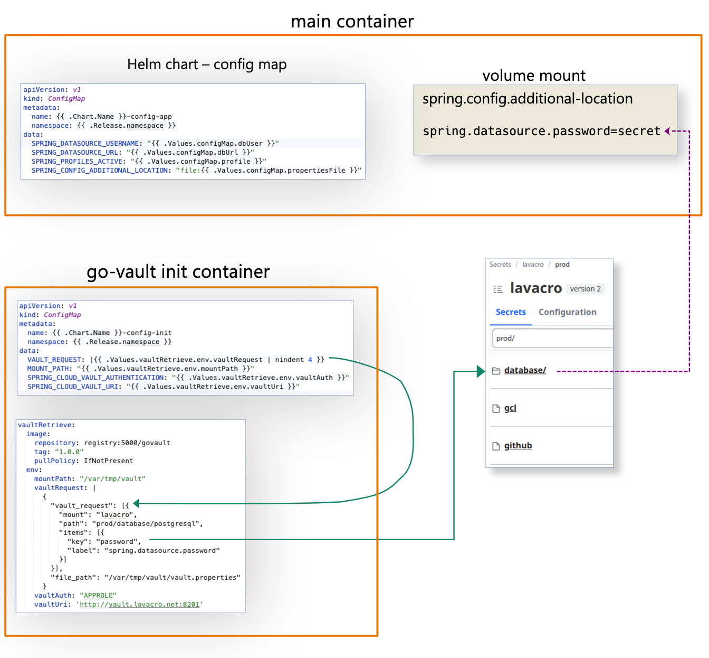

# govault

`govault` retrieves secrets from HashiCorp Vault and writes them to a
name/value file that is natively consumable by Spring Boot applications.
Applications in any other language can easily parse the file as well.

`govault` is a Go port of the Java/Spring Boot
[vault-retreive](https://github.com/davidr69/vault-retrieve)
application. It is a clean reimplementation but also redesigned for
simplicity. Spring Cloud Configuration integration has been removed in favor
of Helm charts. This means that `govault` serves one very specific purpose:
retrieve secrets from Vault and write them to a file.

## Design

`govault` is based on an example provided in the official documentation:
https://pkg.go.dev/github.com/hashicorp/vault/api. `govault` leverages
the KV2 secrets engine and the AppRole authentication method, meaning
that rather than using a long-lived token, `govault` uses a Role ID and
a Secret ID to authenticate to Vault, receiving a short-lived token which
is then used to retrieve secrets.

The Spring Vault configuration requirement was to specify a path such as:
`lavacro/data/prod/database/postgresql` and retrieve specific keys. That means
that the mount of `lavacro` and the implicit `data` segment must be
explicitly provided. However, the Go Vault API requires that the mount be
specified separately from the path and avoid adding `data`.


## Usage

`govault` requires three environment variables to be set:

1. VAULT_ROLE_ID: the role ID for the AppRole authentication method
1. VAULT_ROLE_SECRET: the secret ID for the AppRole authentication method
1. VAULT_REQUEST: a JSON document specifying what secrets to retrieve
   and where to write them. For example:

```json
{
  "vault_request": [{
    "mount": "lavacro",
    "path": "prod/database/postgresql",
    "items": [{
      "key": "password",
      "label": "spring.datasource.password"
    }]
  },{
    "mount": "lavacro",
    "path": "prod/gcl",
    "items": [{
      "key": "authentication",
      "label": "google.cloud.logging"
    }]
  },{
    "mount": "lavacro",
    "path": "prod/github",
    "items": [{
      "key": "token",
      "label": "github.token"
    }]
  }],
  "file_path": "/var/tmp/vault/vault.properties"
}
```

The Go Vault client library looks for the `VAULT_ADDR` environment variable,
which is the Vault endpoint URI.


